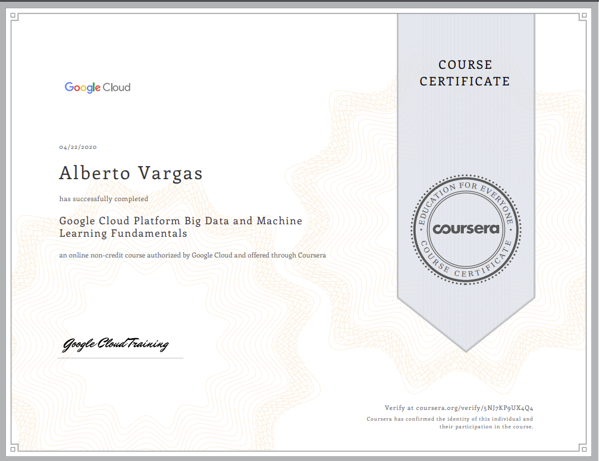
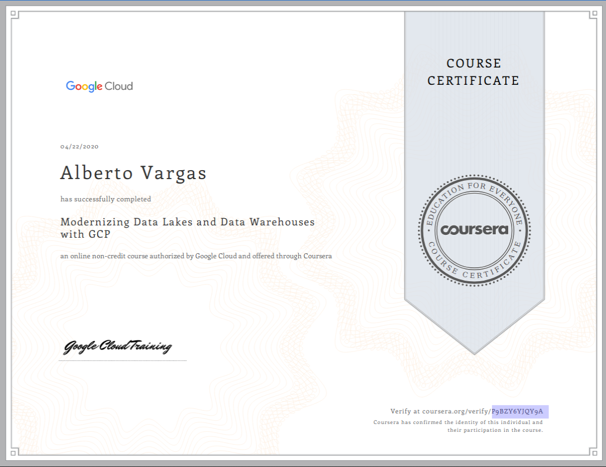
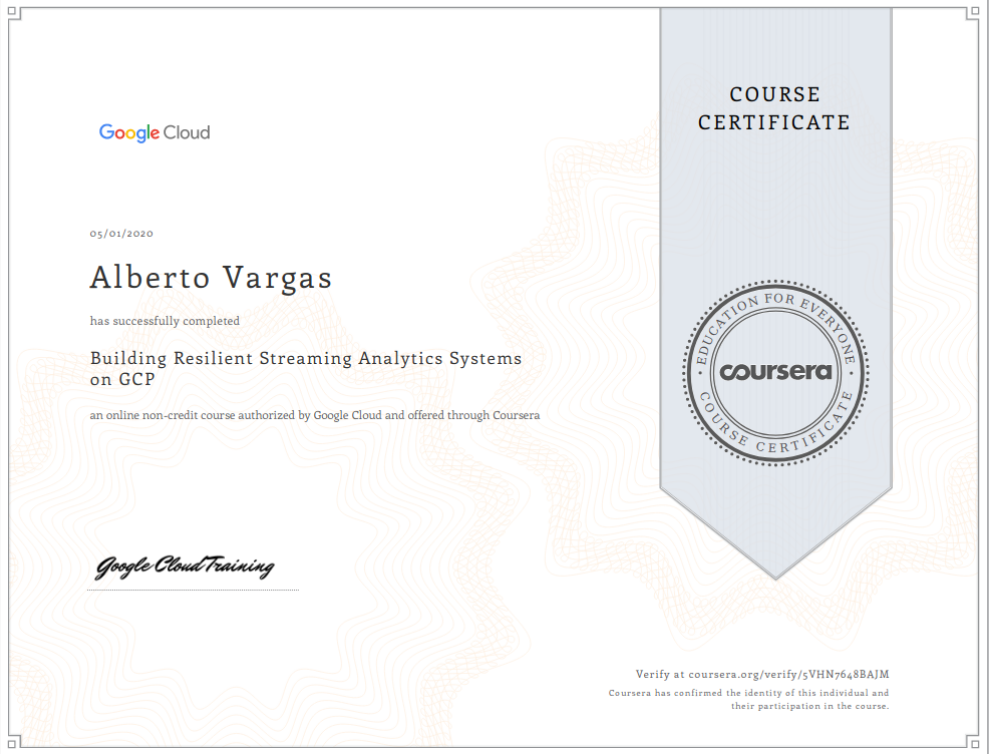
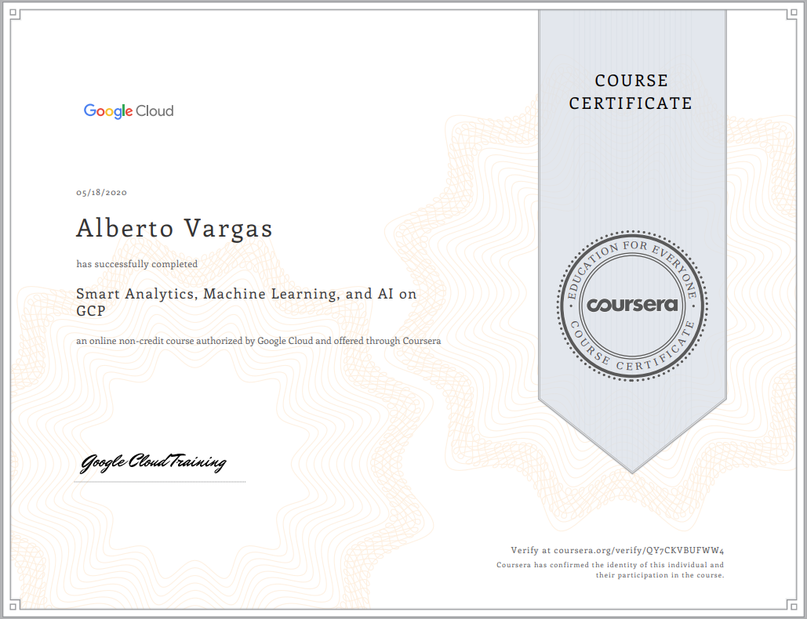
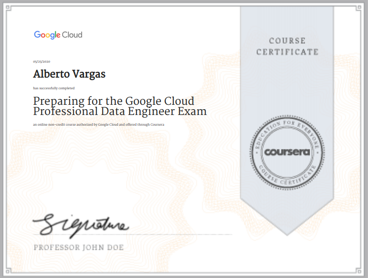
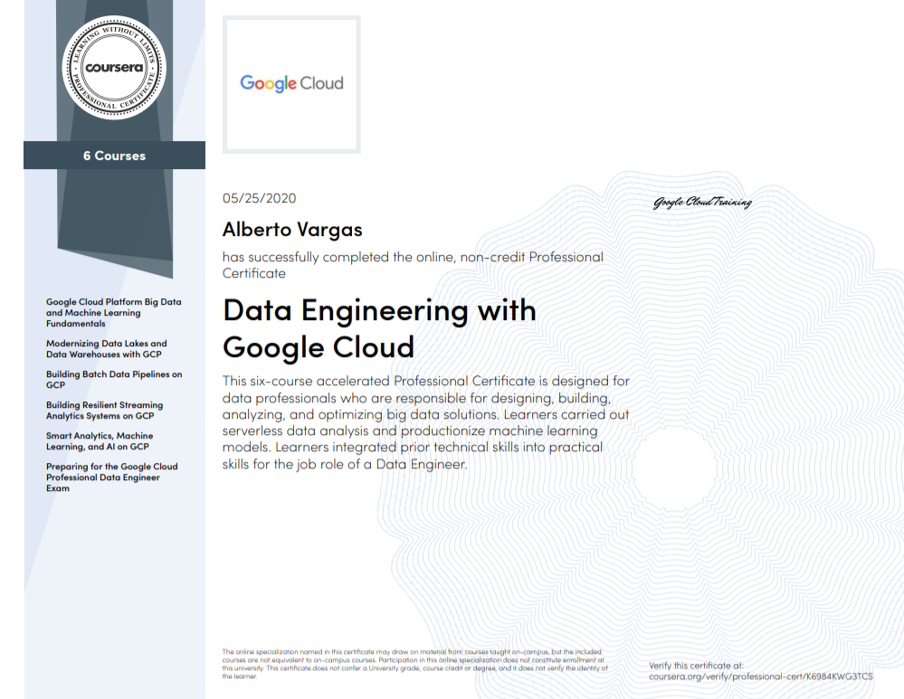
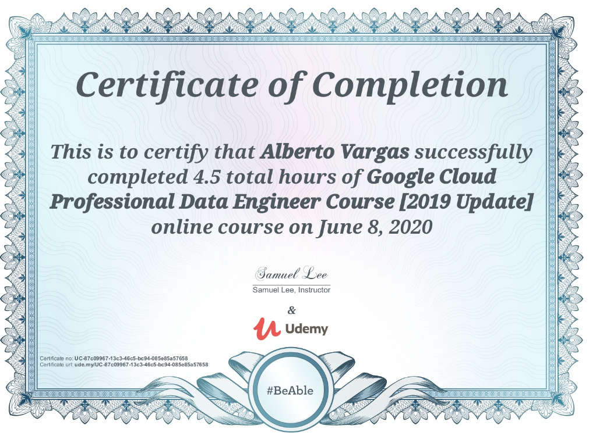
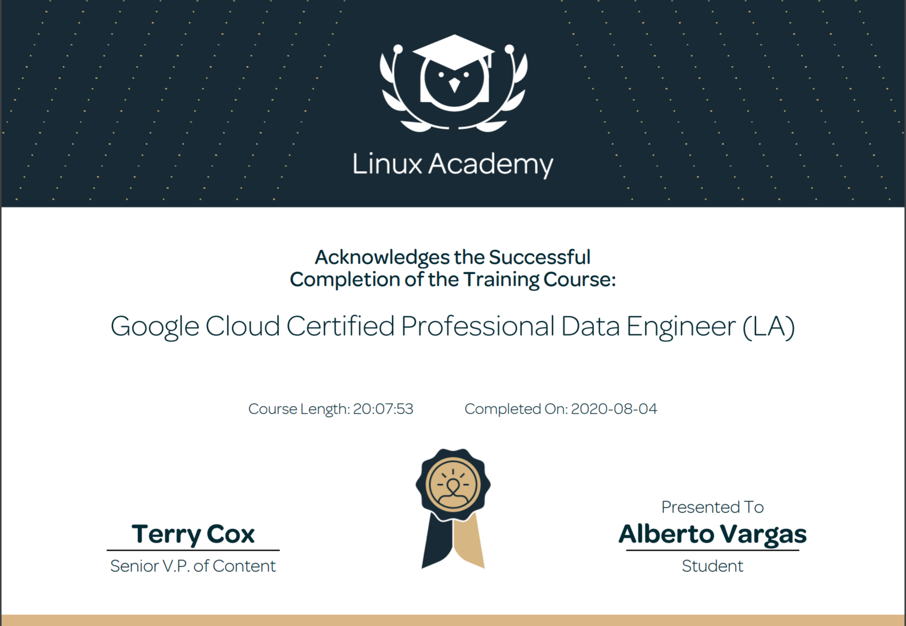

**Goal:** To pass the Professional Google Cloud Certificate exam.

**Courses to sit for this exam:**

- Google Cloud/Coursera: Data Engineering with Google Cloud Professional Certificate (6 courses) => https://cloud.google.com/certification/guides/data-engineer/

- Udemy:    Google Cloud Professional Data Engineer => https://www.udemy.com/course/learn-gcp-become-a-certified-data-engineer-express-course **(periodically redo this quizzes)**

- Udemy:    Ultimate Google Cloud Certifications: All in one Bundle (4) => https://www.udemy.com/course/google-certified-architect-developer-engineer-data-devops/learn/lecture/15679938#overview

- Linux Academy: Google Cloud Certified Professional Data Engineer => https://linuxacademy.com/course/google-cloud-certified-professional-data-engineer/

- Testprep Training: Professional Data Engineer Exams => https://www.testpreptraining.com/index.php?route=account/test&test_id=427

- Data Engineering on GCP PDF (by ml874) => https://github.com/ml874/Data-Engineering-on-GCP-Cheatsheet/blob/master/data_engineering_on_GCP.pdf

- Udemy: 2 exams => https://www.udemy.com/course/google-professional-data-engineer-certification-x/

--------------------------------
--------------------------------

1. Google Cloud Platform Big Data and Machine Learning Fundamentals.

2. Modernizing Data Lakes and Data Warehouses with GCP.

3. Building Batch Data Pipelines on GCP.

4.  Building Resilient Streaming Analytics Systems on GCP.

5. Smart Analytics, Machine Learning, and AI on GCP.

6. Preparing for the Google Cloud Professional Data Engineer Exam.

- Certification of compeltion of the specialization courses:

7. Google Cloud Professional Data Engineer. 

8. Ultimate Google Cloud Certifications: All in one Bundle (4).

    *Pending*

9. Linux Academy: Google Cloud Certified Professional Data Engineer.

