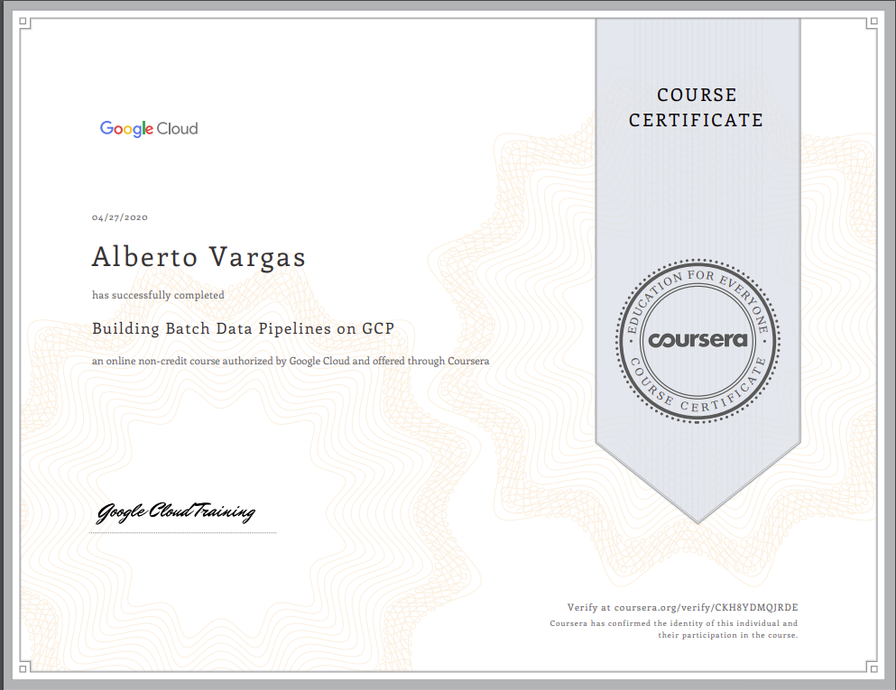

All courses I am doing to prepare this exam:

- Professional Google Cloud Certificate (6 courses)

--------------------------------

**Professional Google Cloud Certificate**
- Data Engineering with Google Cloud Professional Certificate (6 courses)

1. Google Cloud Platform Big Data and Machine Learning Fundamentals.

2. Modernizing Data Lakes and Data Warehouses with GCP.

3. Building Batch Data Pipelines on GCP.

4.  Building Resilient Streaming Analytics Systems on GCP.

5. Smart Analytics, Machine Learning, and AI on GCP.