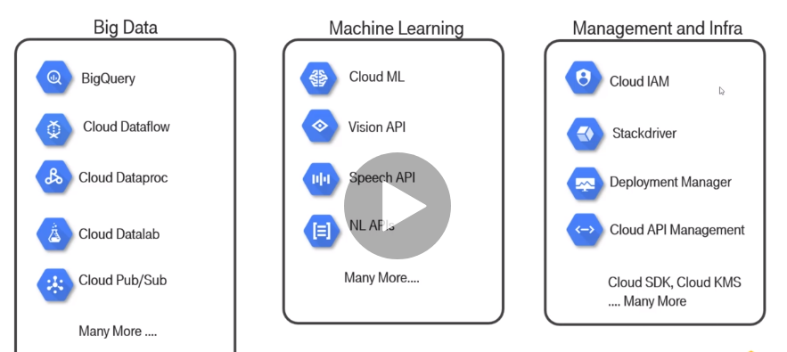

- Notes i found interesting

# Google Cloud

--------------------------

**- BigQuery:**

It is way faster to use a lot of with clauses in the beginning

    WITH name AS (
        SELECT..
    )

than select everything and use a lot of conditions after.

A good example:

        WITH
        rentals_on_day AS (
        SELECT
            rental_id,
            end_date,
            EXTRACT(DATE
            FROM
            end_date) AS rental_date
        FROM
            `bigquery-public-data.london_bicycles.cycle_hire` )
        SELECT
        rental_id,
        rental_date,
        ROW_NUMBER() OVER(PARTITION BY rental_date ORDER BY end_date) AS rental_number_on_day
        FROM
        rentals_on_day
        ORDER BY
        rental_date ASC,
        rental_number_on_day ASC
        LIMIT
        5

Denormalizing:

        WITH
        denormalized_table AS (
        SELECT
            start_station_name,
            end_station_name,
            ST_DISTANCE(ST_GeogPoint(s1.longitude,
                s1.latitude),
            ST_GeogPoint(s2.longitude,
                s2.latitude)) AS distance,
            duration
        FROM
            `bigquery-public-data`.london_bicycles.cycle_hire AS h
        JOIN
            `bigquery-public-data`.london_bicycles.cycle_stations AS s1
        ON
            h.start_station_id = s1.id
        JOIN
            `bigquery-public-data`.london_bicycles.cycle_stations AS s2
        ON
            h.end_station_id = s2.id ),
        durations AS (
        SELECT
            start_station_name,
            end_station_name,
            MIN(distance) AS distance,
            AVG(duration) AS duration,
            COUNT(*) AS num_rides
        FROM
            denormalized_table
        WHERE
            duration > 0
            AND distance > 0
        GROUP BY
            start_station_name,
            end_station_name
        HAVING
            num_rides > 100 )
        SELECT
        start_station_name,
        end_station_name,
        distance,
        duration,
        duration/distance AS pace
        FROM
        durations
        ORDER BY
        pace ASC
        LIMIT
        5

# BigQuery in Notebooks

A simple and smooth example

- request

        %%bigquery df
        SELECT
        departure_delay,
        COUNT(1) AS num_flights,
        APPROX_QUANTILES(arrival_delay, 10) AS arrival_delay_deciles
        FROM
        `bigquery-samples.airline_ontime_data.flights`
        GROUP BY
        departure_delay
        HAVING
        num_flights > 100
        ORDER BY
        departure_delay ASC

- check percentiles (cool way)

        import pandas as pd

        percentiles = df['arrival_delay_deciles'].apply(pd.Series)
        percentiles.rename(columns = lambda x : '{0}%'.format(x*10), inplace=True)
        percentiles.head()

- concat to previous df

        df = pd.concat([df['departure_delay'], percentiles], axis=1)
        df.head()

- draw it

        df.drop(labels=['0%', '100%'], axis=1, inplace=True)
        df.plot(x='departure_delay', xlim=(-30,50), ylim=(-50,50));

------------------------------------------

# ML pipeline in Google Cloud Environment 

- ML specialization:
https://www.coursera.org/specializations/machine-learning-tensorflow-gcp

# Tools

- Infraestructure services

**- Resources to practice:** 

- Practise the exam:

    https://www.cloud.google.com/certification/practice-exam/data-engineer

- More practising:

    https://www.qwiklabs.com/catalog?keywords=&cloud%5B%5D=GCP&format%5B%5D=any&level%5B%5D=any&duration%5B%5D=any&price%5B%5D=any&modality%5B%5D=any&language%5B%5D=any

---------------------------

# Udemy:   Google Cloud Professional Data Engineer. 

- **Periodically redo this course.** 

https://www.udemy.com/course/learn-gcp-become-a-certified-data-engineer-express-course 

----------------------------

- If in bigquery we want to make a join with all tables with similar names (for instance table1, table2, table3...) we can make it quick with 

- Cloud datalab importating

-------------------

# Ultimate Google Cloud Certifications: All in one Bundle (4).

- cloud sdk well explained

-------------------------------------
-------------------------------------

